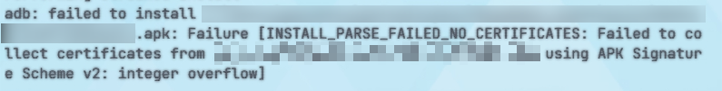

不出意外，这一年的年终总结也是25年才写的，233333333333。
因为今年才开始写年年终总结嘛，不过得益于从23年6月开始就有记录日记，总结的材料来源还是有的。

# 2023年更新日志

## MainChange-主要收获
- 了解到了TDD
- 实现了一个Addressable热更Demo
- 进入主程试用期

今年是我认为我自己代码水平提升最大的一年。
《黑客与画家》，《代码整洁之道》，这两本书对我非常有帮助，在这里推荐。从意识上去学习怎么做好"程序员"这个职位。

看B站别人翻译的一个视频[Clean Code - Bob](https://www.bilibili.com/video/BV1ZD4y1t7sk/)，认识到了TDD的概念，对我真的受益匪浅。可测，所以结果是可预知的，也意味着你的修改是快速检测的。这种方案写代码会稍微费一点额外的时间，但是带来的那种安心的感觉无可比拟。
这是一种对自己代码的信心，对接不再需要说:"应该可以做完"，而是能给出准确验收时间。

虽然升职是很开心，但是心里其实也知道。
怎么可能嘛，入行一年多就说自己是主程，一问三不知。就当给自己加油吧，欲速则不达。
## Feature - 学会了什么
- Unity后处理
- UnityAddressable使用
- Android构建环境配置
- Android构建流程
- Android权限概念
- iOS后处理
- 接入SDK

这么看好像学得挺少的2333333。

## Bugfix - 踩了什么坑

- Spine遮罩卡顿
	- Spine中的遮罩效果对于遮罩物所使用的顶点有要求，最好只使用3个顶点，否则会在Runtime造成比较严重的卡顿。[文档传送门](https://zh.esotericsoftware.com/spine-clipping)
- Android-APK签名错误导致无法安装
	- Android打包中，由于谷歌推行了政策使用新的签名版本，这个签名对APK的大小有限制，因为用int去做校验的一些数据存储，所以最大APK是2G。
	- Gradle会在构建的时候使用如`ADT`或者`Signflinger`进行签名，Signflinger在3.6.0和4.0.1的(AGP)版本下都不会报错，但4.0.1使用ADT签名则会报此错误。(AGP = Android Gradle Plugin)
- Unity-CacheServer污染导致无法打开项目
	- CacheServer的本质是加速同步资源变化带来的重导入过程，监听Library中资产的信息变化。后续因为时间原因，只能先清空CacheServer，重新刷新Library解决。
## 对接
- 和需求方对接不够仔细，有自以为的部分，导致做完的效果和需求方完全不一样，好在代码扩展性还可以，很快就改好了。
- 经常在需求上有时间数据上的歧义，策划认为是国服时间(UTC+8)，但是我们逻辑用零时区，随后同步，策划写需求文案的时候可以写国区时间，但得多加一个全球服时间给程序使用。

做需求之前，确认好要做的事情，尽可能沟通排除掉歧义部分，同时考虑未确定部分，是体现程序专业性的一个重要因素。