AI润色

> 本文由 @空白 佬提供技术支持，谢谢 Bro。

从需求入手，先明确"想要做什么"，再去理解"为什么要这样做"。

本文着重点在 PBR 和 VRS，其他内容需要自行拓展阅读。

# 概览

- 需求一：风格统一。效果都偏向写实，而不会出现卡通或魔幻之类的风格。
- 需求二：制作效果不受人数影响的管线。无论场景还是灯光，所有人制作内容的时候，效果都是一致的。
- 需求三：可以稳定在移动端运行。

## 做了什么？

- 根据需求，确定了 PBR 工作流下的制作细节规范。
- 自研 Blackjack SRP RenderGraph 管线，支持更多自定义功能以及加载流程管理。
- 自研工具集，提供给美术岗、测试岗提高效率。

# 渲染

主要涉及：着色、灯光、材质。

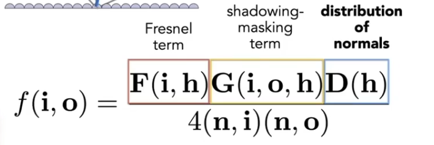

材质决定了光如何与表面交互。项目采用了 PBR 流程，这套流程已经非常标准了，只需要根据自己项目的需求制定一些准则即可。

PBR 比起一些基础的渲染光学计算，多了三个元素：光辐射率、微表面、能量守恒。而如何从更接近物理的角度去解析光从入射到反射再到进入视野的过程，所描述的公式就称之为 BRDF。

那么 PBR 是否可以理解为：比起直接用光学模型去计算，增加了描述表面对光的"散射"和"吸收"的部分（BRDF），从而达成更接近物理的渲染？

基于流程，需要逐个确认所选的 shader 模型：

1. Shading Model —— 决定如何着色
2. Lighting Model —— 如何处理与光的交互
3. Material Model —— 如何定义材质，以满足前两者规则下实现目标效果

## Shading Model 的选择 - 直接光部分

漫反射部分：

- 通用：迪士尼漫反射
- 非金属：优化版迪士尼漫反射，目的是降低处理指令数
- 地形：预积分迪士尼漫反射，目的是降低处理指令数

镜面反射部分：

- 通用：GGX
- 非金属：优化版 GGX，降低指令数

## Shading Model 的选择 - 非金属部分

优化的目标：降低指令数。

### 怎么做？

对 Disney BRDF 做优化，减少指令。

1. 一般游戏中纯金属的物体非常少，只有少部分如机甲，或者抛光场景中的金属才会有这个需求，所以 metallic=1 的情况非常少。优化手段：将 metallic 和 F0（垂直于材质的光的反射率）设置为常量值。

> 金属的 F0 通常在 0.9 以上，非金属通常较低（木头、塑料）：0.04-0.08。

> F0：入射角为 0 度、光垂直射入时的反射比例，表示固有反射率。通常金属会采用 0.04~1，而非金属会有个固定的 0.04 的值。

游戏中除了机甲和部分场景元素外，很少有完全是全金属的物件。所以对于这些大部分是"非金属"的内容，可以使用 Metallic 值和 F0 值固定的方式来减少计算。

2. 对于 Diffuse 和 Specular BRDF 中的 Schlick 计算 F0 部分，采用球面高斯去代替。

> （个人疑问：这个说法是不是有问题？Diffuse 漫反射部分应该不会用到 Schlick 这种菲涅尔的近似公式去算吧？）

#### Fresnel Reflection

菲涅尔反射，是一条由法国物理学家奥古斯丁·菲涅耳提出的光学方程，用于描述光在两种不同折射率的介质中的反射和折射，其中反射部分也被称为菲涅尔反射。

比如看近处的水可以看到底下的小石子和鱼，而远处的则只看到来自反射的蓝天白云。

通常菲涅尔的光照计算非常复杂，渲染中使用 Schlick 去做近似处理。还有一种近似等式是 Empirical 菲涅尔近似等式。

### 球面高斯和 Schlick 公式

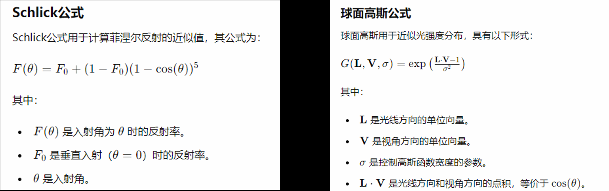

> exp(x) = e^x

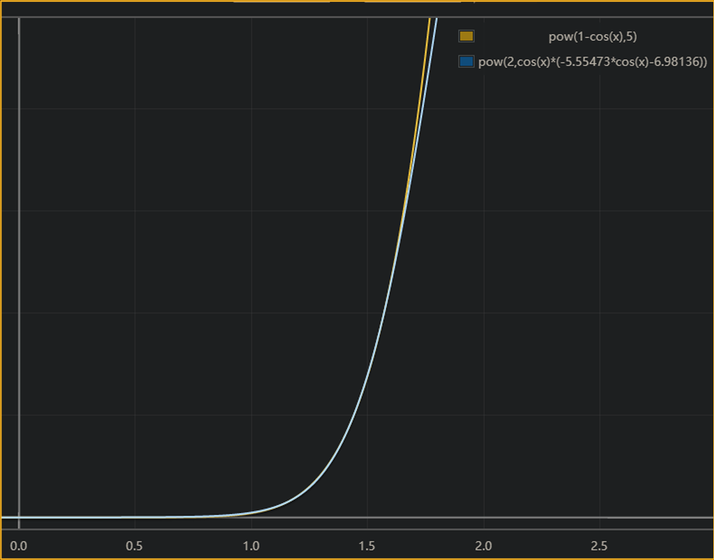

这里演讲者提到，不是通过肉眼观测，而是通过数学建模去确认效果近似。但渲染上有一句话：如果它看起来是正确的，那么它就是正确的。都对吗？只要数学建模对了，那么大部分情况下看起来都是正确的。

### 效果

- Disney 漫反射指令：19 -> 11
- Disney 高光指令：24 -> 18

## Shading Model - 地形部分

使用 Pre-integrated Disney Diffuse 代替 Diffuse BRDF。不再需要运行时计算漫反射，直接从预处理的数据去获取。

因为游戏中的地形都近似平坦、垂直朝上（战棋游戏），所以法线比较明确，大部分都是朝着天顶的；而且光照角度基本是明确的，比如基本都是早晨、正午、黄昏等时间。同时使用 Matlab 对预积分 Disney Diffuse 和常规的方向光 Disney Diffuse 各自建模，在某些角度下值的变化趋势非常相似，所以直接选择了 Pre-integrated Disney Diffuse。

原话是："用 GGX Environment BRDF 去做 Pre-integrated 的信息，去替代 Disney Diffuse 的 BRDF 的运算。"对比了预计算 Disney Diffuse 和直接 Disney Diffuse 建模后，在某些光照角度下的变化趋势，结果显示非常相似。

对于用到的 Disney 的 BRDF 关于 Diffuse 的计算就直接跳过了，只需要采样 Pre-Integrated 的图就可以了。

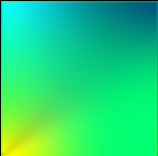

> （个人疑问：这个说法很奇怪，GGX 是用来做高光处理的，为什么会拿高光处理的预处理信息去算 Diffuse 的信息呢？我认为应当有一套自己的方式去处理漫反射部分，因为光照和角度都是确认的。但你说他真拿了 GGX 的信息去渲 Diffuse 那部分，行不行也不好说？漫反射部分用预积分的漫反射没关系，但高光部分又拿 GGX 的去做是什么意思？Disney 是一套渲染公式，还是反射公式？）

Q：所以这个认知对不对？反射方程比渲染方程少了自发光的部分，而且原渲染方程还会考虑时间、光的波长等要素。反射方程处理光时，是将半圆内各方向的输入光分两部分对视野点进行求和，分别是漫反射和高光部分。而 BRDF 是指如何处理微表面和光的反应，如果所用的 BRDF 模型包含对漫反射和高光的处理，则 BRDF = 物体反射方程？

A：问了空白，通常直接说 BSDF，BRDF 和 BTDF 是它的子集，BSDF 包含对漫反射和高光的处理。实际对于渲染的总流程：将物体表面法线方向为中心的半球体内的光线，都根据选择好的 BSDF 模型进行计算求和，最终得到视野点的结果。BRDF 并不只是漫反射，还有镜面反射、散射、投射等等。对于不同的模型（如 Disney、GGX 等），可以根据自己的需求混合使用，比如区分直接光和间接光、区分漫反射和镜面反射等。

由于项目特性，我们可以假定：地形平坦（大部分法线确认）、固定的光照角度（无 TOD 需求）。

预积分结果和图中对比：垂直方向记为 0，反向垂直记为 100，等于 0 的时候就是正午的时间。

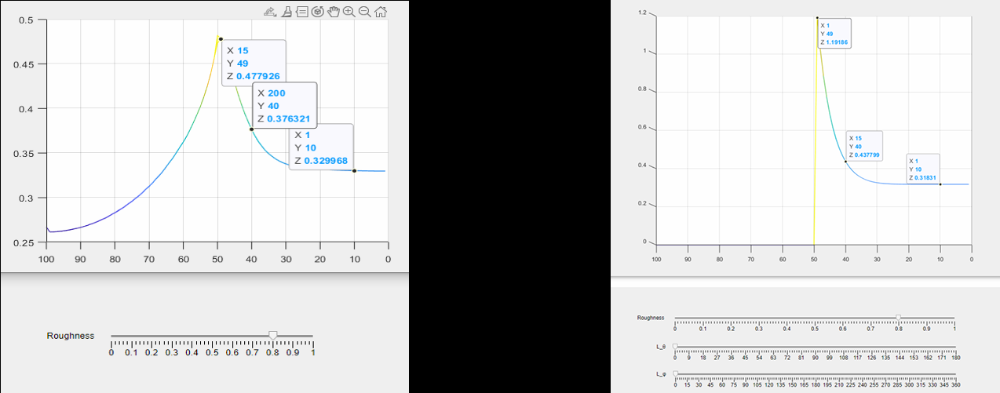

因为是近似而不是相同，所以会有误差，误差部分美术会通过新的美术效果去解决。这套方案可以等同于直接砍掉了地形部分的实时反射光计算（存在预处理数据里）。

项目用过 VT，但 VT 对于钢岚的项目而言收益不高。

## Shading Model 的选择 - 间接光部分

间接光就是被其他物件映射过来的颜色等。实现 GI 的方式有很多种：VXGI、DDGI、SDFGI，还有 PRTGI。间接光也有反射和折射。

漫反射部分采取了 PRT Relighted 3D Lighting，高光反射部分采用了 HDR Cubemap。场景中放置 PRT Probe 去采样。

引入两个点：

- PRT：预计算辐射传输，用于计算光效，是全局光照的一种方案。
- HDR Cubemap：用立方体六个面去表达环境光源，以此实现高动态范围图像的效果，属于常规做法。

PRT 看起来都是预处理光，但和光照探针的主打方向不一样。光照探针的目的是预处理来表现动态物体在静态光下的效果，而 PRT 是计算光照效果。

### 直接光

直接光上只用了基础的：方向光、点光、射灯（SpotLight），移动端的点光源不带阴影。

项目中静态点光和静态物体烘出的 shadowmap，再把动态加到场景的机甲，写到那张 shadowMap 中去，作为场景中对点光的处理。

> 那不是意味着每次移动机甲都要叠加新的 shadowMap？

### 间接光

通常间接光由 GI 部分完成。常见的实现方式有 LightMap、LightProbe 采样等。方案选择上则有：

- Reflective Shadow Maps（RSM）
- Light Propagation Volumes（LPV）
- Voxel Global Illumination（VXGI）
- Precomputed Radiance Transfer（PRT）

#### 需求

由于项目中使用的机甲和场景等都是几乎 1:1 的大小，所以需要特殊处理来照亮这些内容。比如机甲 12M 就是 12M 的比例尺。

不希望场景中不同的物体使用不同的光照系统去处理。

内置的 Lightmap 适合静态，LightProbe 适合动态，但 LightProbe 对 Interpolation（插值）功能缺失，导致对大型动态物件的支持比较差，比如颜色渐变。

当布置好 LightProbe 之后，左边蓝色的墙（Static）就可以对右边的球（Dynamic）产生蓝色的漫反射。

> 这套方案下动态的内容无法对静态的内容产生漫反射。

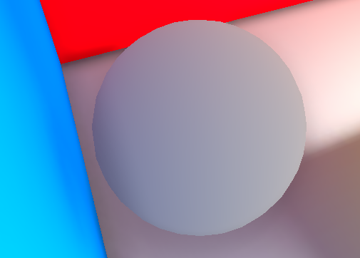

Unity 默认 GI 的 LightProbe 的 Relighting 是逐对象的：示例图中右面是一堵大型的墙，但采样却出现问题。

> 预期结果：墙中心出现一个圆形的光斑。

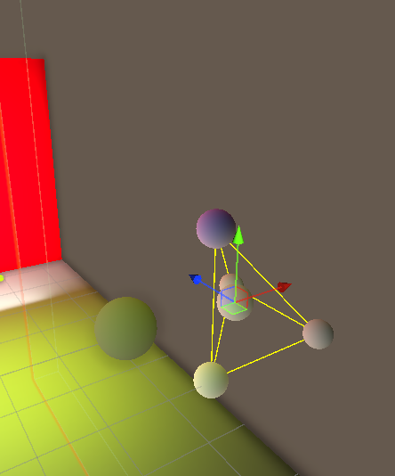

目标：兼容静动态、无视物体大小，确保精确的效果。

#### 怎么做？

使用存储 PRT Relighting 的 3D Texture 作为数据媒介。将整个场景的 PRT 数据烘焙后存到 Probe 中，以 HL2 的方式进行存储。

> hl2 = HL2 basis，一种存储预计算全局照明的方法。

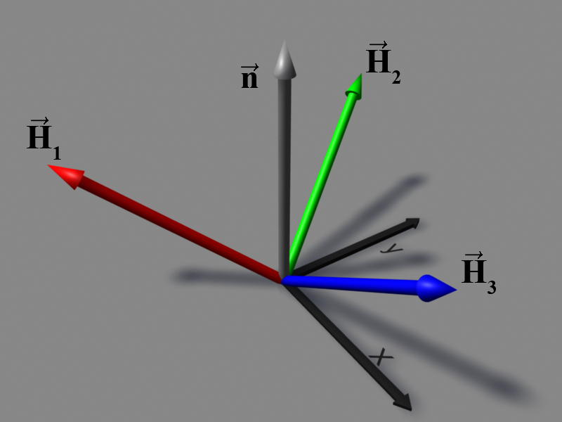

这里用的是一套业界比较常见的 PRT 渲染方案，通过"体积"这个概念去处理上面遇到的物体过大的问题，这也是钢岚的需求。

场景是 200x200 的一个区域，迭代光照后再做滤波处理，64\*64\*16 的精度可以满足需求。

这里应该指的是傅里叶变换。傅里叶变换在声音编辑上可以做到将不同频率的声音拆开来的效果，比如音频中有尖锐的杂音覆盖了原本的声音，可以通过傅里叶变换找到高频部分进行抹平，之后再逆向回去。可以参考：https://www.bilibili.com/video/BV1pW411J7s8/。但这是对音频的处理，那么对图像而言，类似的工具则是球谐函数。

HL2 的好处是什么？基于半圆的时候，任何一个光线都可以描述为针对某一个方向有正值？

PRT Relighting：区分了 Global 和 Local 的 PRT。PRT 烘焙的同时，会烘焙 Sky Visibility，以在 Relighting 中提供天光遮罩的数据。

间接光数据来源：射灯、点光、区域光、HDRI、Emissive（材质自发光）、方向光。

使用了物理光照的系统，采用阳光 16 法去为自动曝光参数范围设置提供参考。移动端的半精度使得较强的自然光强度无法计算（over 65504），会导致比如正午时间没办法正确计算或产生差距。于是对移动端的光照强度和曝光参数都做了二次映射。

使用 Pre-Exposed Color 来应用曝光，也就是在材质层面去做的，而不是？？？（听不清）。

HDRI：High Dynamic Range Image，包含 HDR 的环境光信息。24EV，即 24 个曝光程度不同亮度信息合并出来的一张图，足够亮，且拥有一切必要的亮度信息。

发现拍出来的 HDRI 有曝光补偿，所以用了一个 NUKE 的软件来将 EV 拉平成 1EV 的一张图，之后才在 HDRI 天空盒材质中应用曝光补偿。

计算机中通常 Log(x) 不写底数，默认以 10 为底。

## 机甲涂装

除开机甲本身就是按照 PBR 金属流制作之外，还有额外的三种效果：漆面、磨砂、电镀。对应 albedo、normal、OM 的信息。

但游戏中有机甲的自定义需求，所以在普通的材质上添加了 Dye-Mask 来控制涂装区域。

提供了一个 Scene 给美术，让他们可以在选择不同时间、天气、混合状态下，对材质正确与否进行监视，即环境切换工具。

场景美术也是从这个 Scene 去拿资源来搭建，这样就不需要再对物体去做各种各样的缩放。缩放对性能不好，而且查起来非常麻烦，所以有这个场景分类：小、中、大、远、近。

而且这个场景有会用到的所有资源，也能在这里收集所有用到的 Shader 变体。

### 清漆层 - ClearCoat

在标准的材质金属层上一层薄且半透明的材质。清漆层没有 diffuse，而是通过再计算一层高光（采样 Specular 的？？？）来模拟"清漆"的效果。

为了让漆层更明显，计算间接光的时候采用了 Mipmap=0 的环境贴图进行采样（环境贴图也有 Mipmap？）。

对于清漆层的直接光，Specular BRDF 是两层叠加：基础层根据 coatMask（哪块地方有清漆）去对第一层 Diffuse 和 Specular 的信息做 Scale，对于 Specular 则会再加一层清漆层的高光进行叠加。对于间接光则只对 Specular 做处理，对基础项进行缩放后进行叠加（为什么要缩放？）。

### 磨砂 - Frosting

使用了 Reoriented Normal Mapping 进行纹理混合。

磨砂是细节纹理，所以贴图采取三线性插值采样，避免 Mipmap 切换导致的过渡瑕疵问题。

做了一个磨砂法线，这个法线是 detail 法线，也是 tiling 的，可以贴到已有的机甲或者金属表面。

### Iridescence

这个效果在 HDRP 里面有，是对？？？薄膜的 BRDF 的抽象，用于做彩虹色一样的效果。

但实际使用的时候，用原始的算法在 Metal 平台没有足够的精度。原因是 Xcode 编译出来的 shader 代码，对于极大值和极小值会有问题，所以在 Xcode 编译后修改，将极大值和极小值预计算。

## 场景 - 雨

是多个效果的复合：

- 雨水材质
- 全场景材质通过 wetness 实现原本材质的湿润效果
- 多层混合材质的地面积水层
- 雨水涟漪
- 雷电光照照亮雨水
- 雨水落到物体表面反弹

### 粒子雨

雨有远近之分，近处的雨需要高精度，远处的则是面片雨。远处的雨是通过一个平面对着摄像机，不断播放 UV 动画实现的。

### 涟漪和水花

用粒子系统实现，脚本全局控制数量、大小、颜色、强度。粒子播放的都是序列帧动画。

### 全场景 Wetness

在所有 PBR 材质上面，都新增了 wetness 的对象，来表示湿润时材质应该怎么变。比如路面就可以通过 wetness 去设置是湿润的马路还是干燥的马路。

### 多层混合材质的地面积水

没多讲。

## 场景 - 海岸

FFT Ocean，基于 Jerry Tenssendorf 的 Simulating Ocean Water 论文里的内容。

使用 128bit 的频谱，通过 FFT 去生成海水波形。算法优化后 0.25ms 的消耗。海水在整个渲染管线开端去做的，风向、波浪都可以调整。

但这只是模拟了海水表面，还需要做海水上岸的效果。这个上岸的效果也是多层混合：

- 海面波浪
- 上岸海浪
- 地表湿润程度

FFT 已经算出了海水顶点在 XYZ 的偏移值，然后再给一个浪花的偏移值。上岸的浪是另一块小块，那个半透明块，通过 Cull 的方式和生成器的情况去生成一个波形，还可以控制往上升、往后缩的节奏。海浪片是绘制在垂直相机里绘制的一张限制在海岸的 Mask 图，然后海岸的多层混合材质会读取这张 Mask 去触发刚刚提到的 Wetness 的效果，去让沙滩被浸润。

# 渲染管线迭代

基于自研的 Blackjack SRP Render Graph 再去做了个项目用的管线（自己做了个 RenderGraph？）。

基础渲染管线的功能是兜底，去除重复工作。项目管线的功能是特化的，所以也要求基础渲染管线的扩展性强。

基于钢岚项目做了迭代：增加了功能节点（其他项目可复用）、资源复用机制优化、将 Graph 改成 SerializedObject 来简化数据加载和实例化、优化编译结果。

由于开发目标只做移动端，所以管线功能支持上比较常规。支持这么一堆东西：前向渲染、TAA、SSAO、Double Gaussian DOF、Energy Conservative Bloom、HDR Tonemapping、Color Grading、FSR 等后效。

另开渲染管线的目的是：在保持美术需求的情况下保持高性能，达到最高画质下在 iPhone 12 的 GPU 消耗在 12-13ms（16.67 => 60FPS），在 FSR 超分之前是 840P。

## VRS

### VRS 介绍

Variable Rate Shading - DX12 / Vulkan。Vulkan 中的叫 VRS，Metal 版本的叫 VRR。

VRS 允许应用去控制片元着色器的着色速率。

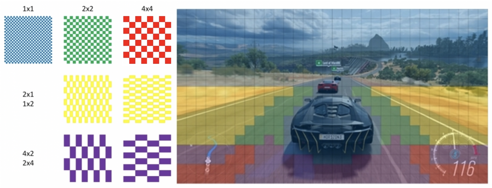

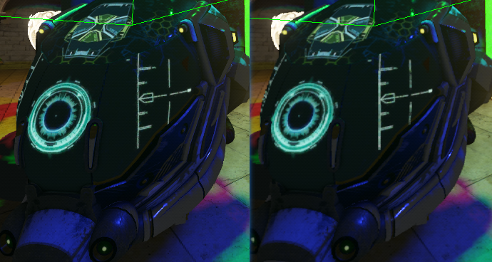

左边是静止的时候，右边是来回移动视野的时候（发生较大动态交互）。

VRS 对于每个 16x16 的像素区域，都给了七个选项，也就是上图七个模式。天空、树叶和赛车按照最高速率，但掠过路面则降低速率。

2x2 即每 4 个小方块共用一个着色结果。假设那个区域有 100x100，你调用了 2x2 的效果，那么就是 50x50 的分辨率去着色，然后放大回 100x100，因为共用数据。

提到了三种模式：Per DrawCall、Per Primitive、Per Attachment。

- Per DrawCall 是最粗粒度的做法，这次 Drawcall 渲染的内容统一按照指定的着色速率去渲染。
- Per Primitive，基于每个渲染基元（三角形、空间多边形）去设置 VRS 渲染。
- Per Attachment，按照开发者提供的附件去设置，也就是目前比较常用的：基于开发者提供的一个 Texture 去指定 ShadingRate。注意：为了实际产生优化效果，此模式也要求你产出附件带来的性能花销比 ShadingRate 改变带来的好处要小。

VRS 是在片元着色器阶段动手脚，所以对其他阶段的影响比较小。

注意事项：如果 GPU 调度中的 warp 指令执行性能低下的关键原因的时候，不要使用 4x4 粗度。具体参考拓展：https://developer.nvidia.com/blog/advanced-api-performance-variable-rate-shading/

WARP：Nvidia Warp 是一个 Python 框架，用来实现高性能的模拟以及图形。

常见优化手段：低分辨率渲染然后放大到目标分辨率。

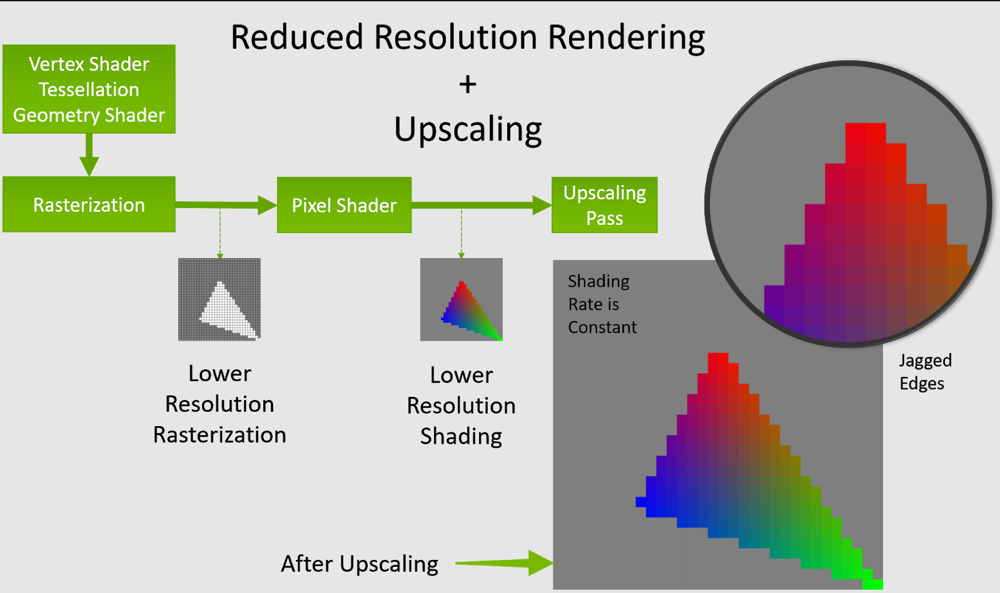

而 VRS，在光栅化的时候保持目标分辨率，在片元 shader 里面对每个 chunk 进行运算平均。

> 需要注意，VRS 中，光栅化的分辨率没变。

VRS 有两种方法去改变渲染倍率：

- 粗糙渲染 Coarse Shading：片元着色器渲一次之后，将渲出来的效果按规则均分到临近的片元上。
- 超级采样 SuperSampling：单个光栅化像素进行多次采样，对采样的结果进行平均。

对应可选的执行颗粒度：

- 粗糙渲染：1x1, 1x2, 2x1, 2x2, 2x4, 4x2, 4x4
- 超级采样：2x, 4x, 8x

> 超级采样就是渲染更高分辨率，再降回目标分辨率，以达到更近似目标的结果。

VRS 的这个渲染速率的控制，不仅可以通过降质量来优化，也可以细化提升质量。

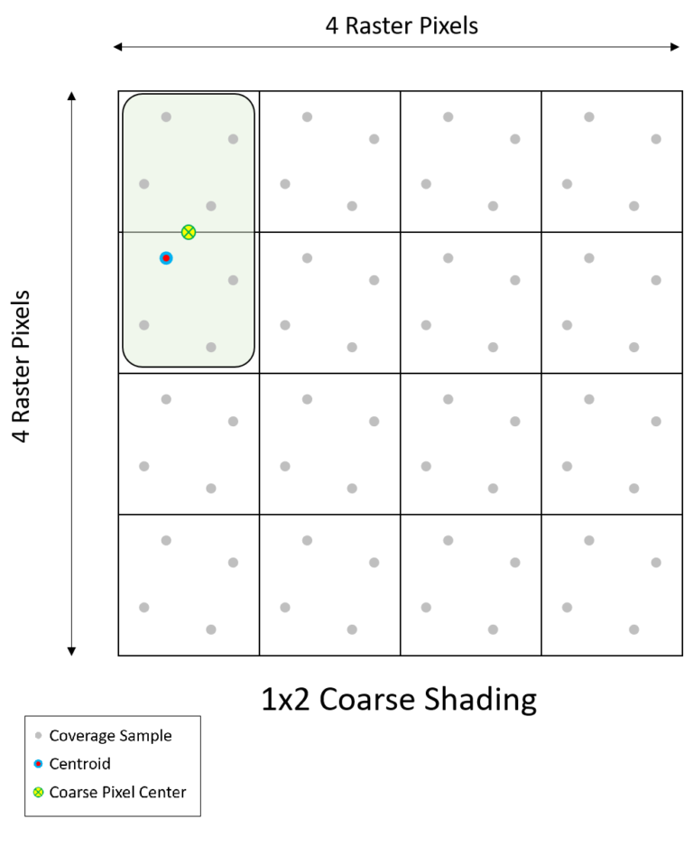

对应的分别是采样点、重心点、粗糙像素中心。

通常为了避免采样点低于"粗糙像素"的范围，在物体的边缘不会降低 VRS。如果 VRS 的所有采样点都是有效的，那么才会认为"粗像素"作为一个像素去共同使用一个渲染结果。

VRS 也支持通过质心（重心）去对粗像素进行插值处理。

最大粗度 4x4 的时候，几乎每个光栅化片元只会有一个采样点。如果所有采样点都在图元里，那么就可以只渲一个像素而将结果复制到 16 个像素里。

官方允许你通过设置 VRS 使用指定的 ShadingRate 去单独给每个 16x16 的 pixel 着色。你可以通过【目标像素】÷16 得到【的像素】。

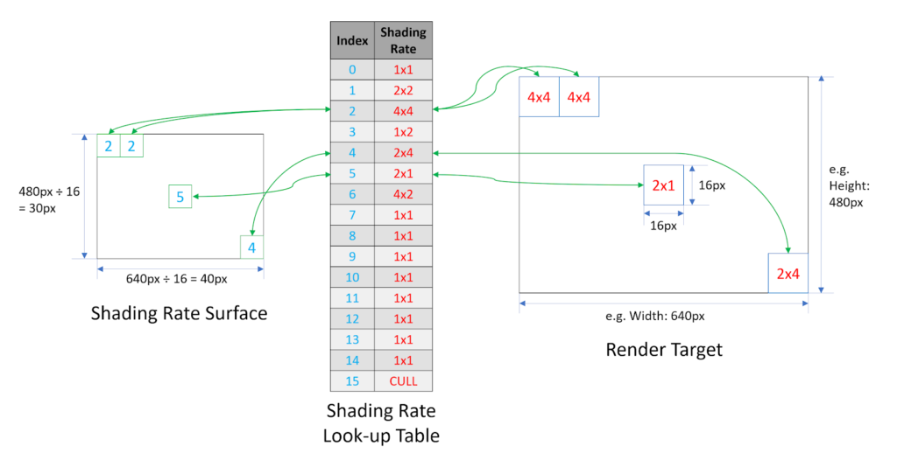

程序可以通过替换这个 ShadingRate 查找表，就可以快速对 VRS 进行新的配置。你甚至可以部分超采样、部分粗采样。

超采样部分示例：

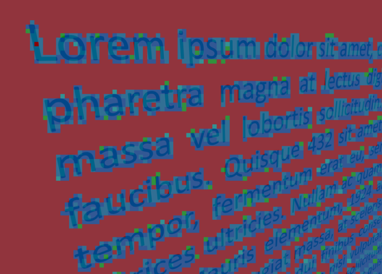

红色是粗渲染，蓝色则是超级采样的高质量文本显示。

VRS 的使用似乎需要申请 Nvidia 才可以用，具体参考 https://developer.nvidia.com/blog/turing-variable-rate-shading-vrworks/。

Unity 并没有原生支持此类技术，所以如果需要使用的话，需要根据目标平台（在 Roadmap 里）写对应的原生调用插件：Window -> DX12、Android -> Vulkan、iOS -> Metal。

### 项目用在哪？

游戏战局中，UI 挡住的部分。因为游戏内大部分 UI 都是半透明的，但同时透明度也比较低，所以对于 UI 后被遮挡的物体属于是"能看到，但是看不清"。这时候直接设置其为最低 Rate 的 4x4。

在绘制 Opaque 物体之前，用两个 pass 生成 VRS attachment，最后将这个 attachment 绑定到 RenderPass 上。

- CustomDrawUIPass：将 UI 使用简单的 shader 绘制在一张低分辨率 RT 上，alpha 大的设置为 1，否则是 0，仅在 UI 更新之后才重新绘制。
- AttachmentGeneratePass：使用 Compute Shader，读取上述 UIPass 的结果，如果一个 tile 的所有像素（16x16）都被 UI 覆盖，就对这个 Tile 写入 4x4 的 Rate，否则就是 1x1。因为怕有些半遮盖的精度下降，作此决策。

新增两个 CommandBuffer 接口，允许绑定 VRS Attachment 以供外部传入我们自己采集的 RT 信息，还有允许动态开关 VRS，可以每个 RenderPass 决定是否开启 VRS。

#### 效果

被 UI 遮罩的内容有明显的精度下降。4x4 带来的就是这块渲染的消耗是原本的 1/16。

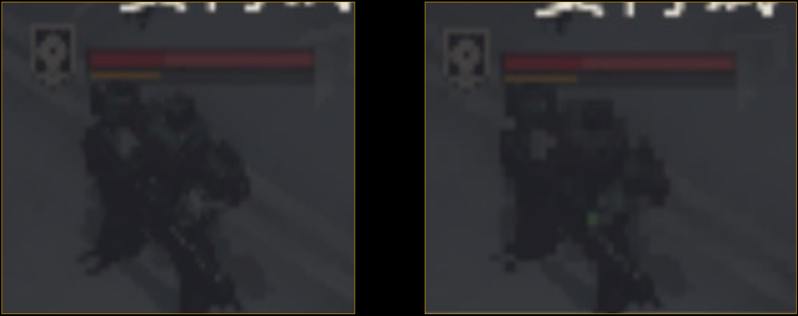

### 注意事项

VRS 也是一个渲染步骤，尽管它能带来性能优化，但优化的程度有限。在落实是否要使用 VRS 去做处理之前，应当测试 VRS 带来的效益是否比得上它产生的消耗。

对于 DX12 而言，VRS 默认支持 1x1、1x2、2x1、2x2，但更往上的则需要看设备是否支持了。VRS 对 MSAA 的支持也有区别，不同粗细度（1x2）对应支持的 MSAA 不一样。对于 Chunk 的大小也是可以二次修改的（8、16、32），但得看硬件是否支持二级 VRS。

## VRR

### 什么是 VRR

Variable Rasterization Rates，Metal 中类似 VRS 的技术，但关键点是"视觉中心区域"。Metal 会自动帮你根据这些区块去生成 VRR 的 Map 去控制。对于如何实际使用可参考：http://dreamfairy.cn/blog/?p=2025。

VRR 和 VRS 一个比较明显的区别就是：VRS 是从片元着色器入手提供可配置项，不会影响光栅化；VRR 则从光栅化入手，生成一张处理过的光栅化结果。VRR 需要开发者主动分块和指定光栅化倍率。

VRR 是真正减少 RT 大小的。VRR 自动创建的 RT 不是一个线性缩放的 RT，Metal 内部会处理，然后告知你真正应用的 RT 的大小。因为对 VRR 会非线性修改 RT，所以需要有 LogicalUV 和 PhysicalUV 的切换。

### 用在哪？

将游戏主界面周围的一圈降低分辨率，分了 5x5 的块。也新增了两个 CommandBuffer 的接口：

- ConfigureVRRMap：可以传入屏幕的切割信息，设定横竖独立的 shading Rate 和分块数量，但是会返回一个 Vector2。
- SetVRRenderingState：每个 Pass 动态决定当前 Pass 要不要开 VRR。

### 效果

可以获取 MetalVRR 返回来的 RT，VRR 可以和 FSR 混用。带宽消耗降低了百分之七十。

## ResourcesManager

管线是基于 SRP RenderGraph。

最优先想要优化的是资源复用机制，希望当资源不再被需要的时候可以还到 Resources 库里面。

为什么要还？单纯用编译器的引用计数来作为资源复用判断的依据，会让管线在运行时的一些变化下，难以简单处理资源回收和复用，比如：场景配置的变化，又或者玩家的设置变化。比如 SSAO 用到了场景中的 materialID，但美术不希望机甲被 SSAO 过分影响。如果关掉了，那么用来画 SSAO 的 materialID 也不应该生成，因为它只被 SSAO 使用到了。

所以新增了一层抽象 ResourceTree，一个 RT 对应一个正在被使用的资源，以及其生命周期中的所有引用关系。

### 怎么做？

每个 RT 对应的都是一个具体的物理资源，每个 Pass 对于每一个用到的 slot 都去对应的 RT 找对应的资源。如果一棵 RT 树的每个子节点都被用完了，那就证明可以回收掉了。

# 便捷通用工具

这部分没什么好说的，都是根据项目需求去落实做的提升效率的工具，保证管线执行到位。如果规范没做好，对后续开发是一个很大的危害。

因为材质不包含对非 tiling 材质的 UV 缩放，也就是美术去缩放这个 UV 的 Scale，就会导致 UV 精度不一致。项目中 UV 精度是定死的。

- DebugView - Histogram：用于显示纯黑白下光线阴暗布局的影调，统一视觉效果。还可以分析直方图的影调构成，给出画面风格用于再次调整。
- DebugView - Waveform：从左到右显示各个像素在各个颜色通道上的亮度分布，美术不再需要凭感觉，而是有根据地去调整。

等等等等。

SceneResViewer：可以找到某一个视角下，所有用到的贴图材质 shader，有多少东西在引用这张贴图（引用计数），比如某个角落非常耗能的 shader，也可以找到。

## Mipmap

用 dds 制作了不同等级的 mipmap，每个等级的 mipmap 对应不同颜色。渲染管线支持 Debugview 去看每个地方的 mipmap。

由自动化测试去识别，比如如果一个物体测出来能用的最大的 Mipmap 是 3，那么就应该对这张图进行缩小。

### Mipmap 简单介绍

Mipmap 是贴图上的"Lod"。生成 Mipmap 会导致内存占用加大（贴图本身也会加大），但在距离远的时候，采用更小的贴图去渲染，所以显存占用小了，对应的纹理带宽也减少了。关 Mipmap 会导致摄像机拉远后，精细的贴图出现"噪点"，所以需要根据情况去选择。

2018.2 的 Unity 新增了流式 mipmap，用到哪一级就只加载哪一级，可以减少内存占用。可以通过代码去动态修改加载 Mipmap 的一些限制，比如最大使用 Mipmap 级。具体可以参考"参考文献"中雨松 Momo 的博客。

## 贴图压缩

对于移动端想要每一张贴图都有合适的压缩率，他们制作了一套神经网络来为每张贴图给出"最佳"压缩格式，并且关联到贴图自动导入工具中，覆盖每一张贴图。通过偏好去选。

BC(DXT) 算法：获取有限的颜色，制作一个线性插值的颜色表，具体像素内不存准确的颜色值，而是相近的插值。

# 关键字解释

## 渲染相关函数模型

### BRDF - 双向反射分布函数

反射模型 BRDF（Bidirectional Reflectance Distribution Function），用于描述表面反射特性的函数，提供一个比例，表示多少入射光可以被反射到出射光的方向。

其他同级概念：

散射模型 BSDF（Bidirectional Scattering Distribution Function）

> 既有 BRDF 部分也有 BTDF 处理的效果。

透射模型 BTDF（Bidirectional Transmission Distribution Function）

> 处理半透明的透光情况，顾名思义，光透射过物体的处理。

双向表面下散射反射分布函数 BSSRDF

> 对于半透明材料，如皮肤，模拟了光线穿透物体表面后再散射出来的复杂光照行为。

BSDF 包含 BRDF 以及 BTDF，也就是类似于一个透明但有磨砂地形的地球仪，其中既涉及 BRDF 去描述的反射，也有描述半透明的 BTDF。

BRDF 并不是具体存在的某个公式，而是一个名字。比如你有一条式子，可以用来描述物体表面应该怎么去处理外来的光，怎么处理物体材质本身的颜色或者其他属性，那么你的这条式子就可以归纳到 BRDF。

### GGX

微表面分布函数 GGX，是一种用于描述微表面法线方向分布的函数，适用于渲染表面粗糙的半透明物体，也可以用于渲染不透明的物体。Unity 使用 GGX 来渲染不透明的物体。

### 迪士尼 PBR

艺术导向的着色模型，而不是物理正确型。迪士尼提出了迪士尼原则 BRDF，通过定义少量简单易懂的参数，优化了此前 PBR 的参数和流程。

使用到的变量有：

- subsurface - 次表面散射，模拟皮肤等半透明材质的散射，还有如硅胶
- metallic - 金属性，指示材质是否是金属
- specular - 镜面反射，控制非金属的高光
- specularTint - 调整高光反射和基础色的混合
- clear coat - 清漆层，描述物体表面的光滑度

等等多种参数共同控制。

Unity 虽然有部分参数是类似的，但 Unity 默认的渲染并不是迪士尼 PBR 渲染。

## PRT Relighting

Precomputed Radiance Transfer Relighting - 预计算辐射传输。相同概念的其他方法是 IBL（Image Based Lighting）。

### HL2

全称 HL2 Basis。

## 抗锯齿

### SSAA

Super-Sampling Anti-aliasing - 超级采样抗锯齿。将图像映射到缓存之后，放大之后再进行采样，获取 2~4 个邻近像素，混合得到最终像素，替代原图层存储起来最终输出到显示器。

AAx2、AAx4 就是原图的放大倍数。比如 x2 去处理 720x480，就是放大渲染分辨率到 1440x960，之后采集临近像素点，获得 720x480 的最终输出图像。

### MSAA

SSAA 的一个变种。MSAA 只对 ZBuffer 和模板（Stencil Buffer）的数据进行 SSAA，理解为只对多边形的边缘进行抗锯齿处理，所以消耗上比 SSAA 小，但是质量也会同步下降。和 SSAA 比起来，只对多边形的边缘进行多重采样去获取像素的颜色值。

## 后处理

### Temporal Anti-Aliasing - TAA

采集前后帧的信息对像素进行抖动实现抗锯齿。对静态的内容好，但动态的内容可能会有"鬼影"。

### SSAO

Screen Space Ambient Occlusion。模拟环境光遮蔽，有些地方被遮挡下，环境光接收得更少，所以需要更暗。

### Double Gaussian Depth of Field

双倍高斯景深。

### Energy Conservative Bloom

能量守恒原则的光晕效果。

### HDR Tonemapping

将 HDR（高动态范围）的图像映射到低动态范围的显示设备上，保留暗部和亮部的细节。

### Color Grading

色调调整。

### FSR（FidelityFX Super Resolution）

用于提升游戏的分辨率和帧率。通过空间缩放技术，以较低的分辨率进行渲染并上采样。

## DDS - DirectDraw Surface

微软给 DirectX 开发的存储纹理的图像，其中包含 Mipmap 信息。

工具：GIMP、Paint.NET

https://apps.microsoft.com/detail/9nbhcs1lx4r0?ocid=pdn_www_index_right&rtc=1&hl=zh-cn&gl=CN

https://www.getpaint.net/

# 参考文献

[VRS-Nvidia](https://developer.nvidia.com/vrworks/graphics/variablerateshading)

[VRR-AppleDocumentation](https://developer.apple.com/documentation/metal/render_passes/rendering_at_different_rasterization_rates?language=objc)

[Unity-SRP](https://docs.unity3d.com/cn/2019.4/Manual/scriptable-render-pipeline-introduction.html)

[BC压缩](https://learn.microsoft.com/zh-cn/windows/win32/direct3d10/d3d10-graphics-programming-guide-resources-block-compression)

[雨松MOMO - Mipmap](https://www.xuanyusong.com/archives/4699)

[LearnOpenGL-CN-SSAO](https://learnopengl-cn.readthedocs.io/zh/latest/05%20Advanced%20Lighting/09%20SSAO/)

[LearnOpenGL-CN-AA](https://learnopengl-cn.readthedocs.io/zh/latest/04%20Advanced%20OpenGL/11%20Anti%20Aliasing/)

[PBR-更精确的微表面分布函数GGX](https://blog.uwa4d.com/archives/1582.html)

[DDS-WIKI](https://en.wikipedia.org/wiki/DirectDraw_Surface)

[可玩的OpenGL工具](https://github.com/BoyBaykiller/IDKEngine)

[Bilibili - Games202高质量渲染](https://www.bilibili.com/video/BV1YK4y1T7yY/)

[烟雨迷离半世殇 - 基于物理的渲染](https://www.lfzxb.top/unity-shader-pbs-base/)

[2012GDC - Persson Tobias实用粒子照明](https://ubm-twvideo01.s3.amazonaws.com/o1/vault/gdc2012/slides/Programming%20Track/Persson_Tobias_Practical_Particle_Lighting.pdf.pdf)

[Nvidia - 高级API功能VRS](https://developer.nvidia.com/blog/advanced-api-performance-variable-rate-shading/)

[微软知识库 - DX12可变速率着色](https://learn.microsoft.com/zh-cn/windows/win32/direct3d12/vrs)

[YangWC's Blog - 高质量实时渲染：实时环境光](https://yangwc.com/2021/04/29/PRT/)

[Nvidia - Turing VRS](https://developer.nvidia.com/blog/turing-variable-rate-shading-vrworks/)

球谐函数在渲染中的作用

[VRR和VRS的差异](https://forum.beyond3d.com/threads/variable-rate-shading-vs-variable-rate-rasterization.62243/)
