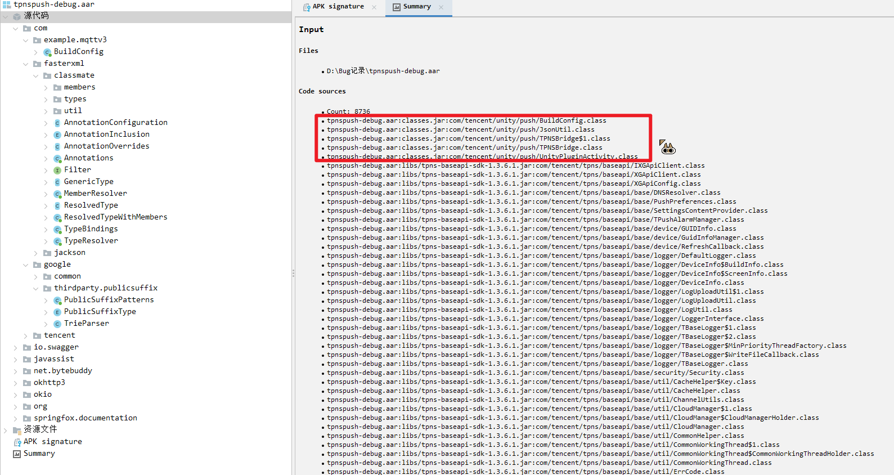

暂时遇到过两个情况需要反编译重新导出aar的
- 腾讯的TPNS移动推送服务旧版核心用到了隐私协议相关的内容，询问后发现其官方unity组件已经不更新了
- 谷歌要求开发者必须在某个时间之前升级应用所使用的谷歌支付库，项目用的是第三方插件所以需要反编译修改

但是步骤都是一样的。
1. 反编译获取源码
2. 用AndroidStudio创建新的Module
3. 复制源码到Module内
4. 修改后Debug处理依赖关系
5. 导出aar

> 需要你有一个认知：反编译出来的大概率是不能直接用的代码，而且依赖是需要手动补充的，还有打包环境之类的配置问腿（Gradle版本、BuildTool版本等）。这是需要时间和耐心的。
``` Java
// 比如反编译出来有多个传参的函数 JADX decompilation
public void DoSomething value1, value2 -> { //Your Code }

// Java format 你需要改成这样
public void DoSomething (value1, value2) -> { //Your Code }
```


推送组件涉及到一个”引入Unity程序集“的步骤，所以就以我个人认为最麻烦的推送作为示例。

# 需求背景
腾讯官方给的Unity的接入方案中用到的工具，版本已经非常落后，同时用旧版本的插件会有一个收集SSID的问题。
官网Unity工具的推送版本:`1.3.6.1`
官网推送SDK：`1.4.4.3`

一般这种情况下有两种解决方案：
- 补充隐私协议，告知用户我们收集了SSID（需要用户同意了才收集）
- 修改SDK，让其不收集

跟腾讯对接结果对方说：
> sdk1.3.9.0及以上不再获取SSID信息，建议最好升级我们最新的版本哈，由于版本跨度较大参考文档注意变更。

然后官方的隐私协议参考文档也没有给出SSID相关的隐私协议内容。虽说不收集了自然就不需要了，反正就是你自己搞定的意思。鉴于腾讯TPNS推送服务已经停售，那确实只能自己处理了。

使用的工具是：Jadx，开源的Java反编译器
传送门：[Jadx - Dex to Java decompiler](https://github.com/skylot/jadx)

# 1、反编译源码
我们先去获取需要反编译的aar。
在此场景下就是一个叫做`tpns-debug.aar`的aar了。
丢到Jadx中反编译。


看着很多代码是吗？其实大部分都是其引用的库的代码，所以我们要分清楚反编译的结果，分出哪些是源码，哪些是引用的第三方库。
源码直接进模块即可，第三方库则通过依赖导入。

# 2、找引用的第三方库
也是刚刚那张图，你可以看到下面有很多引用，比如`tpns-baseapi-sdk-1.3.6.1`
![[2.png]]

需要找全引用了什么库，不过这里有一个很快捷的方法可以找到，就是直接解压aar，从libs里面看看有什么库。
![[3.png]]

# 3、新建项目并新建模块
我们的实际目的是模块。不过因为我个人对AndroidStudio的使用并不熟悉，不知道是否可以直接创建单模块的项目，目前创建的都是一个Android项目里面有个模块这样的情况。

假设你已经创建完了，随便创就完事了，然后这时候新建一个模块，保守起见我们按照解包时候源码里面的包名来填写：`com.tencent.unity.push`
![[4.png]]
![[5.png]]

然后将刚刚反编译获得的四个源码，按照对应的层级放进Module的文件夹里。
libs文件夹就放对应上面找到的第三方库的升级版就行。比如写这个文章的时候获取到的是`1.4.4.3`。

最后libs和src文件夹应该长这样
![[6.png]]
# 4、补充依赖
只是将依赖库放入libs文件夹是不够的，还得连起来。
Android对依赖有几种关系：
- implementation - 编译到目标里
- compileOnly - 包里不包含这个引用，只是写代码的时候引用，运行的时候由runtime负责提供
- runtimeOnly - 写代码的时候不用，打包的时候也打到包里（比如出包用不同于开发的库）
- api : 不动
这里有篇文章有讨论这个关系，可以去看看：[StackOverflow](https://stackoverflow.com/questions/61696863/gradle-compileonly-and-runtimeonly)

我们需要将刚刚的库写进**模块的build.gradle配置里面**，注意，是模块的build.gradle。


# 5、补充依赖 - Unity库
这一步是最麻烦的，可能是因为我不懂Android开发的原因吧。
只是导入unity-classes.jar是不够的。
> unity-classes.jar可以从Editor文件夹获取，比如/2019.4.32f1/Editor/Data/PlaybackEngines/AndroidPlayer/Variations/mono/Release/Classes/classes.jar

解法上参考了Stackoverflow上GuneyOzsan的回答。这里是文章的传送门：
[StackOverflow - cannot find unityplayer activity](https://stackoverflow.com/questions/61865739/cannot-find-the-unityplayeractivity-class-inside-com-unity3d-player)
[UnityDiscussions - 导入Unity库到Android](https://discussions.unity.com/t/integration-unity-as-a-library-in-native-android-app-version-2/759734)

使用2019+的Unity导出有个AndroidStudio项目后，将其中unityLibrary那一部分作为一个新的Module接入。
我在接入后也遇到问题，无论是在插件的build.gradle里面写了怎么导入untiy的jar，一个叫unity-classes.jar的文件，都显示代码无法`import com.unity3d.player`的内容。

参考了上述StackOverflow的解法，UnityModule这边和TPNS插件这边都引用unity-classes.jar才解决。

最终我两个Build.gradle文件的依赖部分是这样的。
TPNS侧：
```java
dependencies {  
    // 手动添加 Unity 的 classes.jar（如果 unityLibrary 未传递依赖）  
//    implementation files('libs/unity-classes.jar') // 需将文件放入 app/libs/ 目录  
    implementation files('libs/tpns-core-sdk-1.4.4.3.jar') // 需将文件放入 app/libs/ 目录  
    implementation files('libs/tpns-baseapi-sdk-1.4.4.3.jar') // 需将文件放入 app/libs/ 目录  
    implementation files('libs/tpns-mqttv3-sdk-1.4.4.3.jar') // 需将文件放入 app/libs/ 目录  
    implementation files('libs/tpns-mqttchannel-sdk-1.4.4.3.jar') // 需将文件放入 app/libs/ 目录  
  
    // 直接从绝对路径获取，这个路径基本安装后就不会变的，所以没关系。  
    compileOnly files('C:/Program Files/Unity/Hub/Editor/2019.4.32f1/Editor/Data/PlaybackEngines/AndroidPlayer/Variations/mono/Release/Classes/classes.jar')  
  
    compileOnly project(path: ':unityLibrary')  
  
    implementation ('io.github.tpnsPush:xinge:1.2.4.22') {  
        exclude group: 'com.google.guava', module: 'listenablefuture'  
        // 如果知道具体冲突的类，也可以这样：  
        // exclude group: 'com.google.common.util.concurrent', module: 'ListenableFuture'  
    }
    // ...若干其他引用库
}
```

UnityModule侧:
```java
dependencies {  
    implementation fileTree(dir: 'libs', include: ['*.jar'])  
    implementation files('C:/Program Files/Unity/Hub/Editor/2019.4.32f1/Editor/Data/PlaybackEngines/AndroidPlayer/Variations/mono/Release/Classes/classes.jar')  
}
```

由于Unity-classes.jar这个库所有版本的UnityEditor自带，所以直接在implementation里面写绝对路径也没关系

# 6、构建aar
之后就直接构建这个插件就好了，要在project界面选中模块的build.gradle才有这个选项。
![[7.png]]

新版AndroidStudio也是选中模块的build.gradle，然后点这个打包aar
![[8.png]]

所有API等级都没变，基本就是更新库导致部分API的传参有变化。
构建完去模块的文件夹的`build/outputs/aar`看有没有导出的aar即可。

需要注意的点是,正如上面提到的几种依赖关系，dependencies里面比如unity-classes这种库，unity自己打包构建APK的时候也会往AndroidStudio工程里面塞一份，这时候会报错重复的库，所以需要将`implementation`关键字换成`compileOnly`。效果就是编译的时候不报错，之后使用的时候由外部环境提供。

> 接下来就看情况改业务代码适配就好了.